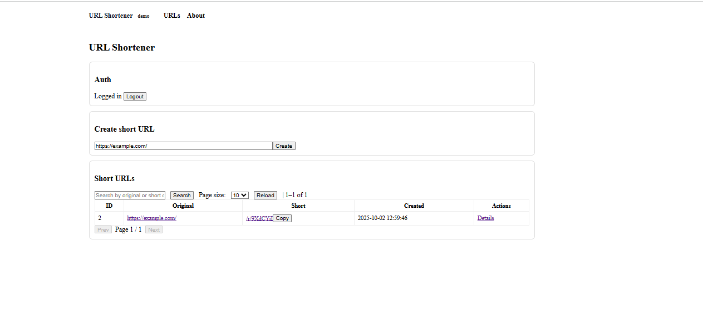
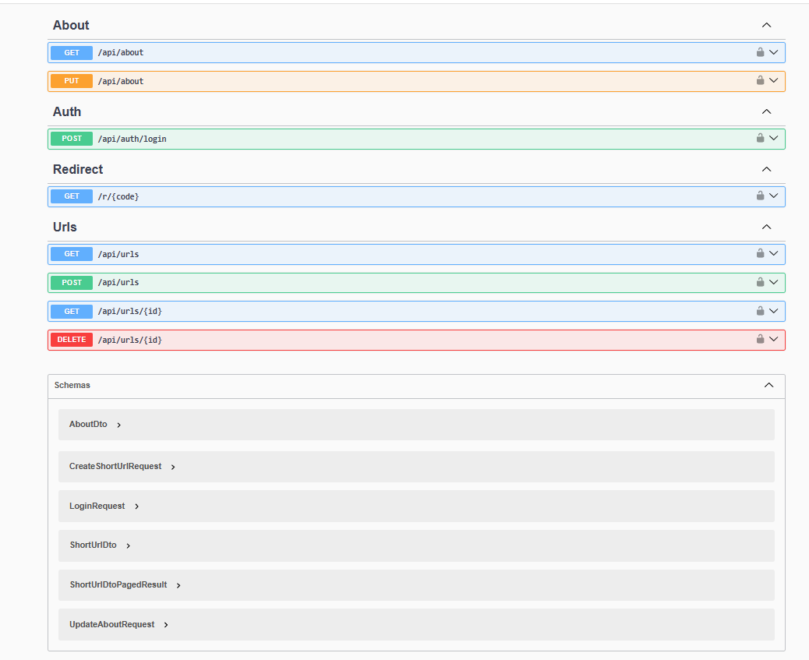

URL Shortener (ASP.NET Core + Angular)

A small URL shortener with JWT auth (Identity), EF Core (SQLite), Swagger, SignalR live updates, server-side search & pagination, and a minimal Angular SPA.

===============Features============

* Short URLs: create, list, open redirect /r/{code}.

* Auth: JWT via ASP.NET Core Identity. Admin policy for protected actions.

* About page: public GET, admin PUT.

* Live updates: SignalR broadcast on create/delete.

* Search & pagination: server-side filtering + paging.

* Swagger: full API docs.

Unit tests: xUnit + FluentAssertions (normalizer, controller basics).

===============Tech Stack============

Backend: ASP.NET Core 8, EF Core (SQLite), Identity, JWT, SignalR, Swagger.

Frontend: Angular 17 (standalone components), HttpClient, basic styles.

Tests: xUnit, FluentAssertions.

=============Project Structure=========

UrlShortener.sln
│
├─ UrlShortener                # ASP.NET Core Web API (controllers, Program.cs)
├─ UrlShortener.Application    # DTOs + abstractions
├─ UrlShortener.Infrastructure # EF Core, Identity, DbContext, Seed, Services
├─ UrlShortener.Domain         # Entities
├─ UrlShortener.Tests          # xUnit tests
└─ url-shortener-ui            # Angular app

=============Getting Started============

1) Backend
cd UrlShortener
dotnet restore
dotnet ef database update   
dotnet run

* Swagger: https://localhost:7055/swagger

* CORS for SPA: http://localhost:4200

* Seeded on first run:

    User: admin@example.com / Admin#12345

    Role: Admin

    About: default content

* JWT is returned by POST /api/auth/login. Use Authorize in Swagger or set Authorization: Bearer <token> in the SPA (added automatically by interceptor).

2) Frontend
* cd url-shortener-ui
* npm ci
* npm start

    SPA: http://localhost:4200

=============API Overview (short)==============

* Auth

  POST /api/auth/login → { accessToken }

* About

  GET /api/about (public)

  PUT /api/about (Admin only)

* Urls

  GET /api/urls

  Query: ?q=<term>&page=<1..n>&pageSize=<5|10|20|50>

  GET /api/urls/{id} (authorized)

  POST /api/urls (authorized) → create short URL

  DELETE /api/urls/{id} (owner or Admin)

* Redirect

  GET /r/{code} → 302 to original URL

==============Tests==================
* cd UrlShortener.Tests
* dotnet test

===============Roles & UI Rules==============

* Server: only Admin or Owner can delete.

* UI: “Delete” button is visible only if:

* user is logged in, and

* isAdmin || createdByUserId === currentUserId (parsed from JWT).

==========Configuration==========

* appsettings.json

* ConnectionStrings:Default → SQLite DB file path

* Jwt section: Issuer, Audience, Key

* SPA: src/app/core/auth.interceptor.ts attaches Bearer token to /api/*.

* ### Screenshots

**UI (Angular)**

**Swagger**

